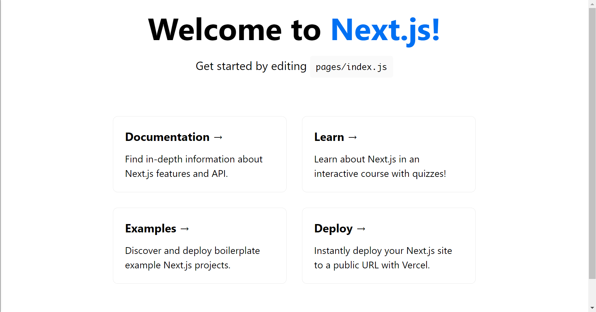
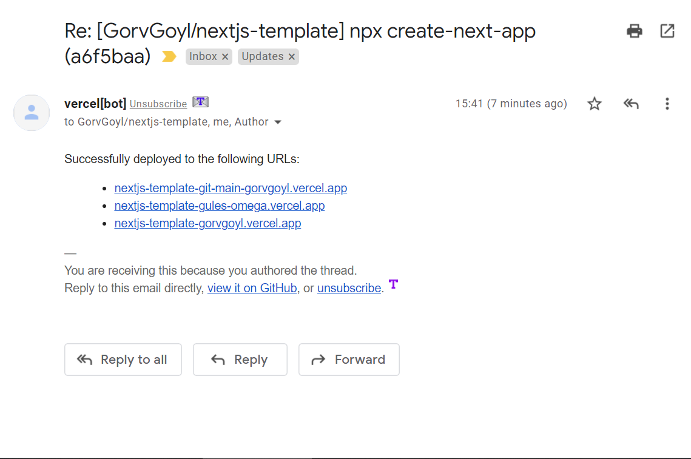
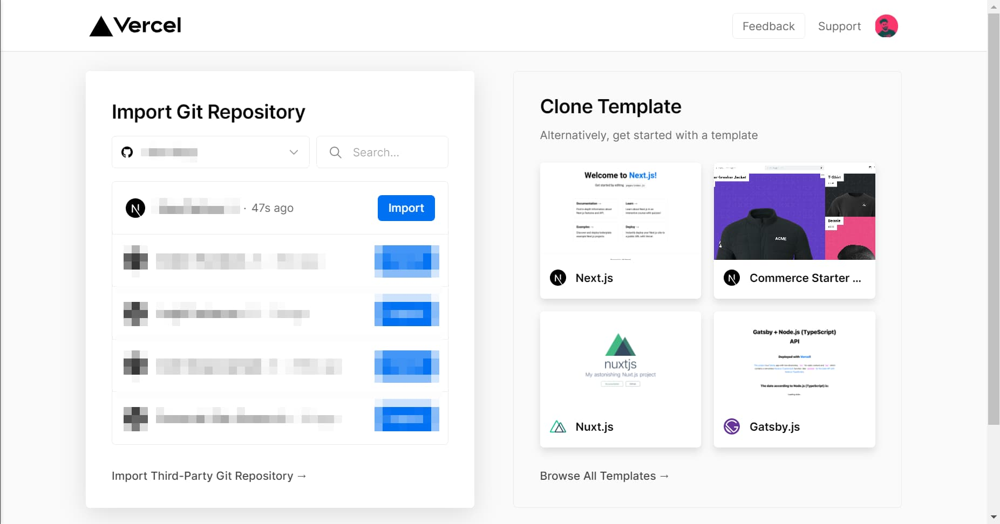
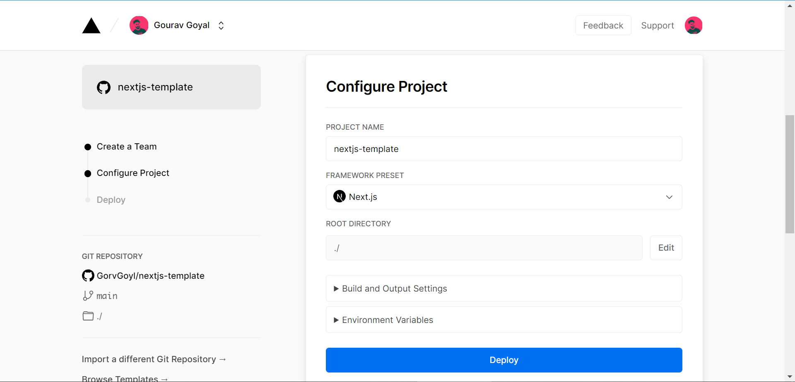
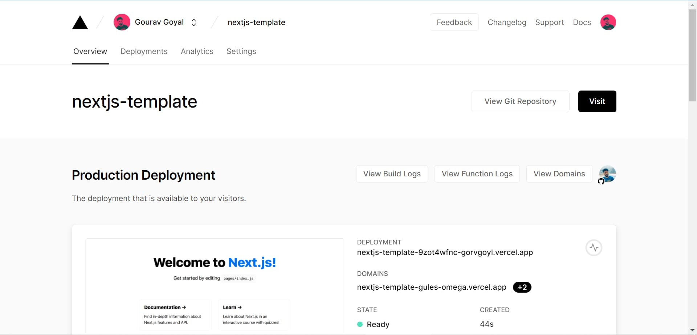
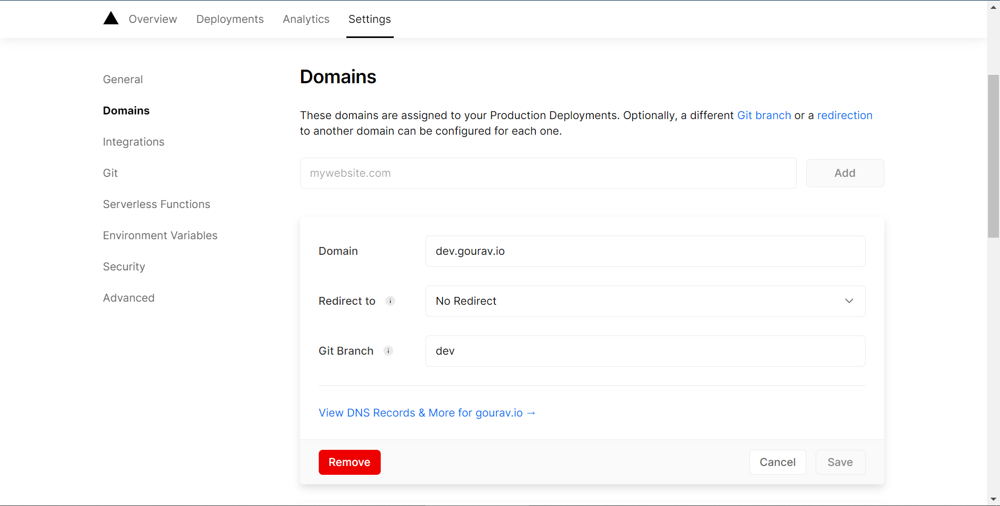
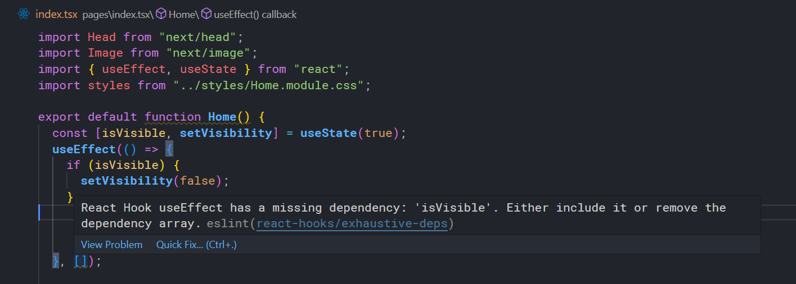
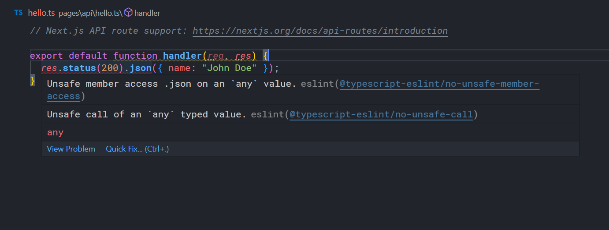
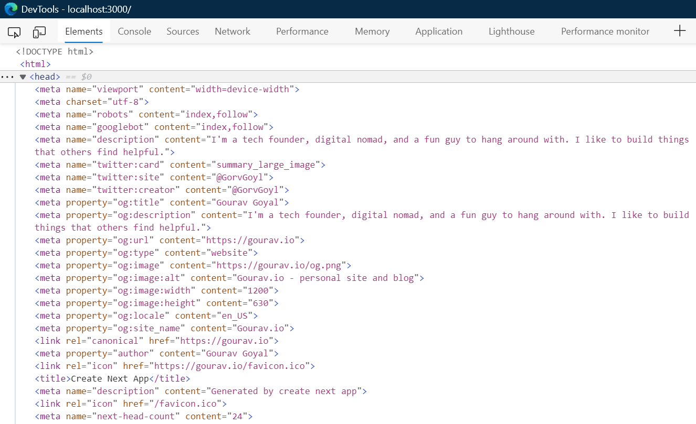

## Setup Next.js project

### Create new Next.js project

- run command:`npx create-next-app`
  - It'll install several packages including react: `react`,`react-dom` and for linting:`eslint`, `eslint-config-next `.
  - You can see [repo changes](https://github.com/GorvGoyl/nextjs-template/commit/a6f5baaa9f334319394d8336b132e33788d7e0ea) at this point.

### Run locally

1. Run command: `npm run dev`

2. Visit `http://localhost:3000`. You'd see something like below image:



### Debug Next.js in VSCode

Useful to put breakpoints in VSCode and pause active session to inspect data.

1. Create a file named `.vscode/launch.json` at the root of your project and paste below content:

```json
{
  "version": "0.2.0",
  "configurations": [
    {
      "name": "Next.js: debug server-side",
      "type": "node-terminal",
      "request": "launch",
      "command": "npm run dev"
    },
    {
      "name": "Next.js: debug client-side",
      "type": "pwa-chrome",
      "request": "launch",
      "url": "http://localhost:3000"
    },
    {
      "name": "Next.js: debug full stack",
      "type": "node-terminal",
      "request": "launch",
      "command": "npm run dev",
      "console": "integratedTerminal",
      "serverReadyAction": {
        "pattern": "started server on .+, url: (https?://.+)",
        "uriFormat": "%s",
        "action": "debugWithChrome"
      }
    }
  ]
}
```

2. Go to VSCode Debug panel (Ctrl+Shift+D on Windows/Linux, ⇧+⌘+D on macOS), select a launch configuration, then press F5 or select **Debug: Start Debugging** from the Command Palette to start your debugging session.

- Types of debugging sessions:

  - `Next.js: debug server-side`: It'll run `npm run dev` command and you'd be able to put breakpoints for both frontend files and api routes.
  - `Next.js: debug client-side`: you need to run `npm run dev` prior to starting this debugging session. Upon starting session it'll open a new chrome window and load your site. You can put breakpoints only in frontend code (no api routes).
  - `Next.js: debug full stack`: It'll open a new chrome window and you'll be able to put breakpoints in both frontend and api routes.

There's a [separate guide](https://nextjs.org/docs/advanced-features/debugging#debugging-with-chrome-devtools) to debug using Chrome DevTools instead.

### Run localhost in mobile

1. Run: `npm run dev`

2. Find your desktop IPv4 address. (For Windows: `ipconfig /all`)

3. Open site in mobile: http://laptop_IPv4_address:3000 (replace `laptop_IPv4_address` with actual IPv4 address)

### Disable telemetry

Next.js collects completely anonymous telemetry data about general usage. Run this command to disable it:

- `npx next telemetry disable`

### Disable emails from vercel[bot] which comes after every github commit



1. Create `vercel.json` at root of project and paste this:

```json
{
  "github": {
    "silent": true
  }
}
```

2. Commit and push this file to Github.

## Deployment

### Netlify

- Deploy [new Next.js project](https://www.netlify.com/with/nextjs/).
- Deploy [existing Next.js project](https://www.netlify.com/blog/2021/05/04/migrating-an-existing-next.js-project-to-netlify/).

### Vercel

1. Commit any pending changes to the repo and link it on Github.
2. Create a free account at https://vercel.com/
3. Create a new project https://vercel.com/new
4. Import this github repository (give Github access to Vercel when asked).
5. Skip creating a team (it's a paid feature) if asked.



6. Click **Deploy**. Vercel will give you a custom public URL (ending with `.vercel.app`) for your site. You can later replace it with your own domain.





#### Deploy to Preview and Production

- Push to any branch other than `main` on Github and Vercel will deploy to a custom public URL (unique for every deployment). Useful for testing purpose before making it live on production domain.
- Push to `main` branch on Github and vercel will deploy to production domain.

#### Link custom domain

[Detailed guide by Vercel](https://vercel.com/docs/concepts/projects/custom-domains)

1. Go to your domain registrar website (Godaddy, Namecheap, etc) and change nameserver to:

```
ns1.vercel-dns.com
ns2.vercel-dns.com
```

2. Now go to https://vercel.com/dashboard/domains and add that custom domain.

#### Create development url like dev.yoursite.com

Creating different environments for development and production is a neat way to do development while maintaining a bug-free production server. All the changes you do on a `dev` branch will be deployed to `dev.yoursite.com` and won't affect your prod site `yoursite.com`. Let's set this up:

1. Create git dev branch: `git checkout -b dev`
   - Commit something (at least one new commit is required for Vercel to deploy this branch)
   - Push branch to github: `git push --set-upstream origin dev`
2. In Vercel, go to project domain: https://vercel.com/{username}/{project}/settings/domains.

   - Add domain: dev.yoursite.com
   - Add Git branch: `dev` and save.

3. Visit your dev site `dev.yoursite.com`

4. Any commits made to `dev` branch will now show in `dev.yoursite.com` along with unique url generated by Vercel for that deployment.

Later, when everything seems okay you can merge code from `dev` -> `main` branch to reflect changes on prod server.

You can create even more branches like testing, staging, etc.

## Add Typescript support

> typescript version at the time of writing this article: 4.4

### Add Typescript when creating a new Next.js project

- Just run `npx create-next-app@latest --ts`

### Add Typescript to existing Next.js project

1. Run `npm i -D typescript @types/react @types/node`.

2. Create empty `tsconfig.json` file at root of project.

3. Run `npm run dev` and it'll fill `tsconfig.json`.

4. Now, Change Javascript files extension to Typescript extension.
   `*.js` files which have react related code (components etc) should be converted to `*.tsx` and rest of `*.js` files should be converted to `*.ts`

```
pages\api\hello.js -> pages\api\hello.ts
pages\_app.js -> pages\_app.tsx
pages\index.js -> pages\index.tsx

```

You can see [repo changes](https://github.com/GorvGoyl/nextjs-template/commit/a28ca0f5329dcafbe149c661710b734823d191b0) at this point.

Test it locally:

- Run `npm run dev` and visit `http://localhost:3000/` (page should look same as before)

- Also, test the api route for file (pages\api\hello.ts)

Visit `http://localhost:3000/api/hello`
output should be:

```
{"name":"John Doe"}
```

### Check for any Typescript errors

1. You can either build the project: `npm run build` (it'll show TS errors)
2. Or create a separate command for it:
   add `"tsc": "tsc"` to `package.json` scripts section

```json
{
  "scripts": {
    "tsc": "tsc"
  }
}
```

- Run `npm run tsc`

### Strict Type checking (Optional)

Strict type checking is useful if you want to further reduce the scope of errors.

- To enable:
  - in `tsconfig.json`
    change `"strict": false` to `"strict": true`
- Now, if you run `npm run build` or `npm run tsc` it'll throw below errors like `XXX implicitly has an 'any' type.`

```
pages/_app.tsx:3:18 - error TS7031: Binding element 'Component' implicitly has an 'any' type.

3 function MyApp({ Component, pageProps }) {
                   ~~~~~~~~~

pages/_app.tsx:3:29 - error TS7031: Binding element 'pageProps' implicitly has an 'any' type.

3 function MyApp({ Component, pageProps }) {
                              ~~~~~~~~~

pages/api/hello.ts:3:33 - error TS7006: Parameter 'req' implicitly has an 'any' type.

3 export default function handler(req, res) {
                                  ~~~

pages/api/hello.ts:3:38 - error TS7006: Parameter 'res' implicitly has an 'any' type.

3 export default function handler(req, res) {
                                       ~~~


Found 4 errors.
```

You can either define the `type` for those errors or suppress these errors by enabling use of `any`.

- To allow use of `any`
  open `tsconfig.json` and add `"noImplicitAny": false` to `compilerOptions`

```json
{
  "compilerOptions": {
    "noImplicitAny": false //set 'true' to throw error for 'any'
  }
}
```

- Run `npm run tsc` and now it shouldn't give you any error.

At this point, complete `tsconfig.json` should look like this:

```json
{
  "compilerOptions": {
    "target": "es5",
    "lib": ["dom", "dom.iterable", "esnext"],
    "allowJs": true,
    "skipLibCheck": true,
    "strict": true, // strict type checking is enabled
    "forceConsistentCasingInFileNames": true,
    "noEmit": true,
    "esModuleInterop": true,
    "module": "esnext",
    "moduleResolution": "node",
    "noImplicitAny": false, // set 'true' to throw error for 'any'
    "resolveJsonModule": true,
    "isolatedModules": true,
    "jsx": "preserve"
  },
  "include": ["next-env.d.ts", "**/*.ts", "**/*.tsx"],
  "exclude": ["node_modules"]
}
```

At this point, complete `package.json` should look like this:

```json
{
  "name": "nextjs-template",
  "version": "0.1.0",
  "private": true,
  "scripts": {
    "dev": "next dev",
    "build": "next build",
    "start": "next start",
    "lint": "next lint",
    "tsc": "tsc"
  },
  "dependencies": {
    "next": "11.1.2",
    "react": "17.0.2",
    "react-dom": "17.0.2"
  },
  "devDependencies": {
    "@types/node": "^16.10.3",
    "@types/react": "^17.0.27",
    "eslint": "8.0.0",
    "eslint-config-next": "11.1.2",
    "typescript": "^4.4.3"
  }
}
```

- You can also checkout the [sample repository](https://github.com/GorvGoyl/nextjs-template/) for Next.js.

## Add ESLint to Next.js Typescript project

> To add ESLint in Next.js **Javascript** project. see https://stackoverflow.com/a/61160352/3073272

There are few steps required for adding proper support of ESLint to TS project:

1. First step to install few ESLint packages is already done at time of creating Next.js project i.e. `npx create-next-app`, it installed `eslint` and `eslint-config-next `.

2. Install TS related ESLint packages:
   `npm i -D @typescript-eslint/parser @typescript-eslint/eslint-plugin @next/eslint-plugin-next`

3. Install VSCode ESLint extension: [ESLint](https://marketplace.visualstudio.com/items?itemName=dbaeumer.vscode-eslint)

> Explanations:
>
> `eslint` is the main ESLint package.
> `@typescript-eslint/parser` will allow ESLint to parse TypeScript files.
> `@typescript-eslint/eslint-plugin` will add TypeScript specific lint rules.
> `eslint-config-next` adds multiple useful plugins (next, react, and react-hooks) ([full list of plugins](https://github.com/vercel/next.js/blob/canary/packages/eslint-config-next/package.json))
> `@next/eslint-plugin-next` to catch common issues and problems in a Next.js application.

4. Create/edit file `.eslintrc.json` at root of project and replace with below content:
   (to mention plugins, configs, rules for linting)

```json
{
  "root": true,
  "env": {
    "browser": true,
    "es6": true,
    "node": true
  },
  "settings": {
    "react": {
      "version": "detect"
    }
  },
  "parser": "@typescript-eslint/parser",
  "parserOptions": {
    "project": "./tsconfig.json", // tells parser relative path of tsconfig.json
    "ecmaFeatures": {
      "jsx": true
    },
    "ecmaVersion": 12,
    "sourceType": "module"
  },

  // all plugins (eslint-plugin-xxx) go here:
  "plugins": [
    "@typescript-eslint",
    "@next/eslint-plugin-next" // https://github.com/vercel/next.js/blob/canary/packages/eslint-plugin-next/lib/index.js
  ],

  // all configs (eslint-config-xxx) go here:
  "extends": [
    "eslint:recommended",
    "plugin:react/recommended",
    "plugin:@typescript-eslint/recommended",
    "plugin:@typescript-eslint/recommended-requiring-type-checking", // contains rules that specifically require type information
    "plugin:@next/next/recommended",
    "next", // https://github.com/vercel/next.js/blob/canary/packages/eslint-config-next/package.json
    "next/core-web-vitals"
  ],
  "rules": {
    // ...add rules which you'd like to disable
  }
}
```

5. Create file `.eslintignore` at root of project:
   (It tells ESLint to ignore files when linting)

```
# don't ever lint node_modules
**/node_modules/*
# don't lint build output (make sure it's set to your correct build folder name)
dist
# don't lint nyc coverage output
coverage
**/.next/*
*.json
*.lock
*.css
*.scss
**/out/*
next-env.d.ts
# next.config.js
```

6. Include support for `*.js` files in `tsconfig.json`:

```json
{
  "include": ["next-env.d.ts", "**/*.ts", "**/*.tsx", "**/*.js"],
  "exclude": ["node_modules", ".next", ".vercel", "out"]
}
```

7. Restart VSCode to activate ESLint.

### Test Linting (ESLint)

VSCode will show warnings and errors in files which have linting issues.





We can also explicitly check for these issues by running a command.

1. Add below to `package.json` scripts if it's not added already:

   ```json
   {
     "scripts": {
       "lint": "next lint"
     }
   }
   ```

2. Run `npm run lint` and you should see some errors & warnings.

Fix lint warnings & errors:

Modify `_app.tsx` according to it:

```tsx
import { AppProps } from "next/app";

import "../styles/globals.css";

function MyApp({ Component, pageProps }: AppProps): JSX.Element {
  return <Component {...pageProps} />;
}

export default MyApp;
```

In `index.tsx`, add return type as `JSX.Element` to `Home` function:

```
export default function Home(): JSX.Element {
```

In `hello.ts`:

```ts
/* eslint-disable import/no-anonymous-default-export */
import type { NextApiRequest, NextApiResponse } from "next";

type Data = {
  name: string;
};
export default (req: NextApiRequest, res: NextApiResponse<Data>): void => {
  res.status(200).json({ name: "John Doe" });
};
```

Run `npm run lint` to test again. There shouldn't be any issues now.

### Disable or suppress linting errors and warnings

- To suppress issue for a particular line basis: `ctrl+.` and select disable for this line. (`ctrl+.` is a VSCode shortcut)

- To suppress issue for entire file: `ctrl+.` and select disable for entire file

- Disable rule for entire project

  - Add that rule to `.eslintrc.json` .

    Options for any specific rule:

    "off": to completely shut this rule.

    "warn": rule violation will show as warning.

    "on": rule violation will show it as error.

    `.eslintrc.json`:

    ```js
    {
    rules: {
          "jsx-a11y/anchor-is-valid": "off", // disable this rule
      },
    }
    ```

`package.json` at this point:

```json
{
  "name": "nextjs-template",
  "version": "0.1.0",
  "private": true,
  "scripts": {
    "dev": "next dev",
    "build": "next build",
    "start": "next start",
    "lint": "next lint",
    "tsc": "tsc"
  },
  "dependencies": {
    "next": "11.1.2",
    "react": "17.0.2",
    "react-dom": "17.0.2"
  },
  "devDependencies": {
    "@next/eslint-plugin-next": "^11.1.2",
    "@types/node": "^16.10.3",
    "@types/react": "^17.0.27",
    "@typescript-eslint/eslint-plugin": "^4.33.0",
    "eslint": "^7.23.0",
    "eslint-config-next": "11.1.2",
    "typescript": "^4.4.3"
  }
}
```

- You can see [repo changes](https://github.com/GorvGoyl/nextjs-template/commit/c2bae33419aa7bfd67d59339fbbb1209847c4520) at this point.

## Add support for Prettier in Next.js project with ESLint

Prettier is an opinionated code formatter with support for many popular languages (js, ts, html, css, etc.). So, whenever you hit `ctrl+s`, it'll beautify/format the file.

1. Install VSCode extension: [Prettier - Code formatter](https://marketplace.visualstudio.com/items?itemName=esbenp.prettier-vscode).

(that's it! do not install any other prettier related eslint plugins or extensions as those make the whole project slow. Let prettier do its job independently. [read more](https://prettier.io/docs/en/comparison.html)

2. In VSCode settings (`ctrl+,`):

- Set `Default Formatter` to `Prettier - code formatter`

- Enable `Format on Save`

2. You may need to disable any formatting related eslint rules as Prettier will handle formatting from now on. You can disable those rules in `.eslintrc.json` or use [eslint-config-prettier](https://github.com/prettier/eslint-config-prettier#installation).
3. Restart VSCode and try to save any unformatted file.

## Add Styling

### Add Tailwind CSS to Next.js project

https://tailwindcss.com/docs/guides/nextjs

1. Install VSCode extension: [Tailwind CSS IntelliSense](https://marketplace.visualstudio.com/items?itemName=bradlc.vscode-tailwindcss)

2. Run: `npm i -D tailwindcss@latest postcss@latest autoprefixer@latest`

3. Run:`npx tailwindcss init -p` (It'll generate `tailwind.config.js` and `postcss.config.js` files)

4. Paste below to `tailwind.config.js`:

```js
module.exports = {
  future: {
    removeDeprecatedGapUtilities: true,
  },
  mode: "jit",
  purge: ["./pages/**/*.{js,ts,jsx,tsx}", "./components/**/*.{js,ts,jsx,tsx}"], // remove unused styles in production
  darkMode: false, // or 'media' or 'class'
  theme: {
    extend: {},
  },
  variants: {
    extend: {},
  },
  plugins: [],
};
```

5. Make sure `postcss.config.js` is also generated with below code:

```js
module.exports = {
  plugins: {
    tailwindcss: {},
    autoprefixer: {},
  },
};
```

6. Paste below to `styles\globals.css`

```css
@tailwind base;
@tailwind components;
@tailwind utilities;
```

7. Import style in `pages\_app.tsx` if not done already

```tsx
import { AppProps } from "next/app";
import "../styles/globals.css";

function MyApp({ Component, pageProps }: AppProps): JSX.Element {
  return <Component {...pageProps} />;
}

export default MyApp;
```

- To add custom CSS styles, see:
  - https://tailwindcss.com/docs/adding-base-styles ,
  - https://tailwindcss.com/docs/adding-new-utilities,
  - https://tailwindcss.com/docs/extracting-components

You can see [repo changes](https://github.com/GorvGoyl/nextjs-template/commit/de5bf82d6d2257ea4bfdaeb8ddd3a37b406490ad) at this point.

### Add SASS/SCSS support to Next.js project

1. Run: `npm i sass`

2. Rename all `*.css` files to `*.scss`

3. Also, update this change in `import` statements i.e. `import "../styles/globals.scss"` , `import styles from "../styles/Home.module.scss";`

That's all. Start writing css styles in scss syntax.

## Add SEO

> Checkout free SEO course by Next.js: https://nextjs.org/learn/seo/introduction-to-seo

### Set Redirect from www.yoursite.com to yoursite.com

It means whenever someone visits www.yoursite.com it'll be redirected to youtsite.com without hurting SEO.

1. Go to domains settings inside Vercel: https://vercel.com/{username}/{project}/settings/domains

2. Add an entry `yoursite.com` if not added already.
   config should be like this:
   domain: yoursite.com
   Redirect to: No redirect possible
   Git Branch: main

3. Add a new entry `www.yoursite.com` if not added already
   config should be like this:
   domain: www.yoursite.com
   Redirect to: yoursite.com
   Status Code: 308 Permanent Redirect
   Git Branch: main

### Add SEO meta tags and favicon

Whenever you share a website link on Twitter, LinkedIn, Whatsapp, etc, you must have noticed that it generates a little preview containing a title, description and a preview image. Platform picks this info from site meta tags. Luckily, there's an npm library which makes it easy to add meta tags to next.js project.

1. Install [next-seo](https://github.com/garmeeh/next-seo#usage): `npm i next-seo`

2. Create a file `header.tsx` and paste below code:

```tsx
import { NextSeo } from "next-seo";
import { useRouter } from "next/router";

export default function Header(): JSX.Element {
  const title = "Gourav Goyal";
  const desc =
    "I'm a tech founder, digital nomad, and a fun guy to hang around with. I like to build things that others find helpful.";
  const ogImgRelativePath = "/og.png";

  const siteURL = "https://gourav.io";
  const ogImageURL = `${siteURL}${ogImgRelativePath}`;
  const pathName = useRouter().pathname;
  const pageURL = pathName === "/" ? siteURL : siteURL + pathName;
  const twitterHandle = "@GorvGoyl";
  const siteName = "Gourav.io";

  return (
    <NextSeo
      title={title}
      description={desc}
      canonical={pageURL}
      openGraph={{
        type: "website",
        locale: "en_US", //  Default is en_US
        url: pageURL,
        title,
        description: desc,
        images: [
          {
            url: ogImageURL,
            width: 1200,
            height: 630,
            alt: "Gourav.io - personal site and blog",
          },
        ],
        site_name: siteName,
      }}
      twitter={{
        handle: twitterHandle,
        site: twitterHandle,
        cardType: "summary_large_image",
      }}
      additionalMetaTags={[
        {
          property: "author",
          content: title,
        },
      ]}
      additionalLinkTags={[
        {
          rel: "icon",
          href: `${siteURL}/favicon.ico`,
        },
        // {
        //   rel: "manifest",
        //   href: "/site.manifest",
        // },
      ]}
    />
  );
}
```

3. Set proper value of `title`, `desc`, `ogImgRelativePath`, `siteURL`, etc.

4. Create favicon.ico:

   - create favicon by image, text, or emoji: https://favicon.io/
   - put `favicon.ico` inside `public/` folder.

5. Create an OG Image (preview image) of size 1200x630, name it `og.png` and put it in `public/` folder.

6. import `Header.tsx` to all of your website pages which need meta tags.

```tsx
import Header from "@/components/header";

export default function Home(): JSX.Element {
  return (
    <>
      <Header />
      ...rest of code
    </>
  );
}
```

To verify metatags:

- Locally you can verify it in dev tools -> Elements -> html/head section:

  

- After deployment you can verify it via https://metatags.io (enter your site name in input field)

### Create dynamic sitemap

#### Using custom post-build script

Up-to date sitemap will be generated every time you do a deployment (during build process) so no need to manually add/update/remove urls in sitemap.

1. Create `/scrips` folder and create new file inside it: `generate-sitemap.mjs`

2. Install required `globby` package: ` npm i -D globby`

3. Paste below to `generate-sitemap.mjs`. Replace `homeURL` with your domain.

```js
import { writeFileSync } from "fs";
import { globby } from "globby";
const homeURL = "https://yoursite.com";

(async () => {
  try {
    console.log("generating sitemap..");

    const pages = await globby([
      "pages/**/*.tsx",
      "!pages/_*.tsx",
      "!pages/api",
      "!pages/404.tsx",
    ]);

    const sitemap = `<?xml version="1.0" encoding="UTF-8"?>
        <urlset xmlns="http://www.sitemaps.org/schemas/sitemap/0.9">
            ${pages
              .map((page) => {
                const path = page
                  .replace("pages/", "/")
                  .replace(".tsx", "")
                  .replace("/index", "");
                const route = path === "/index" ? "" : path;
                const fullUrl = `${homeURL}${route}`;
                console.log(fullUrl);
                return `
                        <url>
                            <loc>${fullUrl}</loc>
                        </url>
                    `;
              })
              .join("")}
        </urlset>`;

    writeFileSync("public/sitemap.xml", sitemap);
    console.log("sitemap generated");
  } catch (e) {
    console.log(e);
    process.exit(1);
  }
})();
```

4. Ignore this file from linting as it's not typescript compatible:

   1. Create`.eslintignore` file at root of project

   2. Add below line:

   ```
   *.mjs
   ```

5. in `package.json` add below `postbuild` step. `postbuild` step will run automatically after the `build` step (due to `post`prefix).

```js
{
"scripts": {
    "build": "next build",
    "postbuild": "node ./scripts/generate-sitemap.mjs"
  },
}

```

- Now if you run `npm run build`, a new file `sitemap.xml` will be created under `./public`:

```
<?xml version="1.0" encoding="UTF-8"?>
        <urlset xmlns="http://www.sitemaps.org/schemas/sitemap/0.9">

                        <url>
                            <loc>https://yoursite.com</loc>
                        </url>

        </urlset>
```

- Also create `/public/robots.txt` and paste below and replace mysite.com with your site. This gives permission to web crawlers (e.g. Google) to crawl and index your site and its pages.

```
User-agent: *
Sitemap: https://mysite.com/sitemap.xml
```

- Check in code and deploy. you should see sitemap by visiting: `https://mysite.com/sitemap.xml`

- Submit this source map to Google: https://search.google.com/search-console

#### Using npm package `next-sitemap`

1. Install [next-sitemap](https://www.npmjs.com/package/next-sitemap):

```
npm i -D next-sitemap
```

2. Create a config file. `next-sitemap` will look for a file named `next-sitemap.js` in the `public/` by default. Using Windows, this does not work because of a naming conflict. Instead, create a file named `sitemap-generator.js` with the following configuration:

```js
module.exports = {
  siteUrl: "https://yourdomain.com",
  generateRobotsTxt: true,
  exclude: ["/en*", "/de*", "/disallowed"],
  alternateRefs: [
    {
      href: "https://yourdomain.com/en",
      hreflang: "en",
    },
    {
      href: "https://yourdomain.com/de",
      hreflang: "de",
    },
  ],
  robotsTxtOptions: {
    policies: [
      {
        userAgent: "*",
        disallow: "/disallowed",
      },
      {
        userAgent: "*",
        allow: "/",
      },
    ],
  },
};
```

3. Finally, add the `postbuild` script to `package.json`

```json
"scripts": {
	"dev": "next dev",
	"build": "next build",
	"start": "next start",
	"lint": "next lint",
	"postbuild": "next-sitemap --config sitemap-generator.js"
},
```

Notice the optional `--config sitemap-generator.js` to point to a different filename than the default `next-sitemap.js`

### Add HTML language attribute and locale

It'll convert from `<html>...</html>` to `<html lang="en-US">...</html>`.

- In `next.config.js` add:

```js
module.exports = {
  i18n: {
    locales: ["en-US"],
    defaultLocale: "en-US",
  },
};
```

### Create dynamic RSS feed

(coming soon)

## Add blogging using MDX

(coming soon)

## Add analytics to Next.js

### Add Cloudflare Web Analytics

> It's free free, lightweight, privacy-friendly, and cookie-less analytics provided by Cloudflare.

1. Create free account at [Cloudflare web-analytics](https://www.cloudflare.com/web-analytics) and get JS Snippet.

2. Create `pages/_document.tsx` and paste below code.
   - Replace `your_token` with your token (from that JS snippet)

```tsx
import Document, { Html, Main, NextScript } from "next/document";
const isProd = process.env.NODE_ENV === "production";

export default class MyDocument extends Document {
  render(): JSX.Element {
    return (
      <Html>
        <body>
          <Main />
          <NextScript />
          {/* Cloudflare Web Analytics */}
          {isProd && (
            <>
              <script
                defer
                src="https://static.cloudflareinsights.com/beacon.min.js"
                data-cf-beacon='{"token": "your_token", "spa": true}'
              />
            </>
          )}
        </body>
      </Html>
    );
  }
}
```

Done. When you deploy your site to production. Cloudflare will track site analytics.

### Add Google Analytics

> It's free but bloated and uses cookies to track visitors.

1. Create a [Google analytics project](https://analytics.google.com/analytics/web/) and get Measurement ID.

2. In your Next.js project, create `/lib/gtag.ts` file and add your Google Measurement ID:

```ts
export const GA_ANALYTICS_MEASUREMENT_ID = "<INSERT_MEASUREMENT_ID>";

// https://developers.google.com/analytics/devguides/collection/gtagjs/pages
export const pageview = (url: URL): void => {
  window.gtag("config", GA_ANALYTICS_MEASUREMENT_ID, {
    page_path: url,
  });
};

type GTagEvent = {
  action: string;
  category: string;
  label: string;
  value: number;
};

// https://developers.google.com/analytics/devguides/collection/gtagjs/events
export const event = ({ action, category, label, value }: GTagEvent): void => {
  window.gtag("event", action, {
    event_category: category,
    event_label: label,
    value,
  });
};
```

3. Also install gtag `types`:

```
npm i -D @types/gtag.js
```

4. Create `/pages/_document.tsx`:

```tsx
import Document, { Html, Head, Main, NextScript } from "next/document";

import { GA_ANALYTICS_MEASUREMENT_ID } from "../lib/gtag";

const isProd = process.env.NODE_ENV === "production";

export default class MyDocument extends Document {
  render(): JSX.Element {
    return (
      <Html>
        <Head>
          {/* enable analytics script only for production */}
          {isProd && (
            <>
              <script
                async
                src={`https://www.googletagmanager.com/gtag/js?id=${GA_ANALYTICS_MEASUREMENT_ID}`}
              />
              <script
                // eslint-disable-next-line react/no-danger
                dangerouslySetInnerHTML={{
                  __html: `
            window.dataLayer = window.dataLayer || [];
            function gtag(){dataLayer.push(arguments);}
            gtag('js', new Date());
            gtag('config', '${GA_ANALYTICS_MEASUREMENT_ID}', {
              page_path: window.location.pathname,
            });
          `,
                }}
              />
            </>
          )}
        </Head>
        <body>
          <Main />
          <NextScript />
        </body>
      </Html>
    );
  }
}
```

5. Create `/pages/_app.tsx`:

```tsx
import { AppProps } from "next/app";
import { useRouter } from "next/router";
import { useEffect } from "react";
import * as gtag from "../lib/gtag";
const isProd = process.env.NODE_ENV === "production";

const App = ({ Component, pageProps }: AppProps): JSX.Element => {
  const router = useRouter();

  useEffect(() => {
    const handleRouteChange = (url: URL) => {
      /* invoke analytics function only for production */
      if (isProd) gtag.pageview(url);
    };
    router.events.on("routeChangeComplete", handleRouteChange);
    return () => {
      router.events.off("routeChangeComplete", handleRouteChange);
    };
  }, [router.events]);
  // eslint-disable-next-line react/jsx-props-no-spreading
  return <Component {...pageProps} />;
};

export default App;
```

Done. When you deploy your site to production. Google will track site analytics.

## Next.js Misc Tips

### Open localhost site whenever you start Next.js server

Open https://localhost:3000 site in browser whenever you run `npm run start`. Add below to `package.json` file:

```json
"scripts": {
    "start": "start http://localhost:3000 & next dev", // for MAC, use `open` instead of `start`
    }
```

### Check if site is running in production or dev server

Many a times we need to enable some code only on production or dev server. You can check if site is running on production environment or dev server:

```js
const isProd = process.env.NODE_ENV === "production";

if (isProd) {
  console.log("it's prod server bois");
}
```

### Use absolute path like @/components instead of relative path

You can use `@/` symbol to access path related to root of project instead of relative to current file path.
For example, you can use `import Header from "@/components/Header";` no matter how deeply nested your file is. No more `../../../components/Header` etc.

1. Add below to `tsconfig.json`:

```json
{
  "compilerOptions": {
    "baseUrl": ".",
    "paths": {
      // use @/ to access path related to root of project
      "@/*": ["./*"]
    }
  }
}
```

2. Add below to `.eslintrc.json`:

```json
{
  "settings": {
    // to support @/ path
    "import/resolver": {
      "typescript": {} // this loads <rootdir>/tsconfig.json to eslint
    },
    "react": {
      "version": "detect"
    }
  },
  "parser": "@typescript-eslint/parser",
  "parserOptions": {
    "project": "./tsconfig.json", // tells parser relative path of tsconfig.json
    "ecmaFeatures": {
      "jsx": true
    },
    "ecmaVersion": 12,
    "sourceType": "module"
  },
  "extends": ["plugin:import/typescript"],
};
```

3. Restart VSCode.

- Now import some code using `@/` in a file e.g. `import Header from "@/components/Header";`
- You can test for any import errors by running `npm run lint`

## Contribute to this cheatsheet

👋 If you'd like to collaborate on this, please [edit here and submit your changes](https://github.com/GorvGoyl/Personal-Site-Gourav.io/blob/main/content/blog/nextjs-cheatsheet/index.md).
